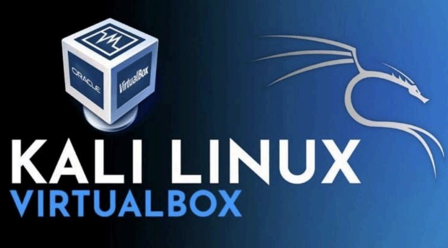
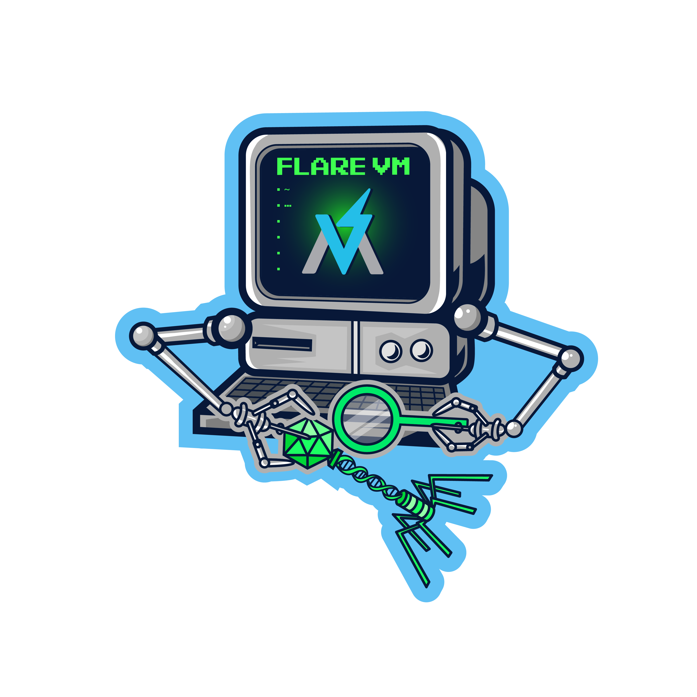

# Setup instructions

Please follow the instructions below to prepare your computer for the [CLA Cybersecurity course](https://codelabsacademy.com/en/courses/cybersecurity).

**Important**. Complete each step in order. If you encounter any issues, don't hesitate to ask an instructor  for assistance.

## Google Meet

We will be using [Google Meet](https://meet.google.com/), for remote interactions.

Go to [meet.google.com](https://meet.google.com) and register for an account.

## VirtualBox

To create virtual environments for our course, we'll be using Oracle VirtualBox to install a few virtual machines, [download it here](https://www.virtualbox.org/wiki/Downloads).

Once you download the installer, just double-click on it to install VirtualBox.

### Kali Linux(VurtualBox Installation)

Kali Linux is a popular Debian-based distribution used for penetration testing. With over 600 pre-installed tools, it's ideal for security assessments. For optimal security, it's recommended to run Kali as a virtual machine on VirtualBox.

Download ready to use virtual image of Kali Linux. Head to Offensive Security's download page to download the [VM image for Virtualbox](https://www.kali.org/get-kali/#kali-virtual-machines).

Kindly refer to the Kali Linux installation on VirtualBox guide on the LMS 

### Windows 10 or Windows 11(VirtualBox Installation)

To effectively participate in the Blue Teaming path, it's advisable to have **Windows 10 or 11 installed**. To minimize potential security risks and system instability, it's recommended to run Windows in a virtual machine rather than on your primary operating system

Head over to the download page to download the [VM image for Windows](https://developer.microsoft.com/en-us/windows/downloads/virtual-machines/)

:warning: **Ip**.

### Metasploitable 2(VirtualBox Installation)

Head over to the download page to download [Metasploitable](https://sourceforge.net/projects/metasploitable/)

Metasploitable is an intentionally vulnerable Linux virtual machine. This VM can be used to conduct security training, test security tools, and practice common penetration testing techniques.

## SysInternals (Windows Download)

Head over to the download page to download the [SysInternals suite](https://learn.microsoft.com/en-us/sysinternals/downloads/sysinternals-suite)

The Sysinternals Suite is a collection of advanced troubleshooting tools for Windows systems, offering deep insights into system processes, disk activity, and network traffic.

## FlareVM (Windows Installation)

Head over to the download page to download the [Flare-VM](https://github.com/mandiant/flare-vm) and follow the installation instructions to install in the Windows Virtual Machine

:heavy_check_mark: Installation of FlareVM will take several hours so be patient :+1:

## OWASP Juice Shop (Kali Installation)

Head over to the download page to download the [OWASP Juice Shop](https://github.com/juice-shop/juice-shop) and follow the docker container installation instructions

## FTK Imager

Head over to the download page to download the [FTK Imager](https://www.exterro.com/digital-forensics-software/ftk-imager) and follow the installation instructions

## Setup completed!

Your computer is ready for the [CLA Cybersecurity bootcamp](https://codelabsacademy.com/en/courses/cybersecurity) :muscle: :clap: Please note over the course of the bootcamp, you may need to download additional tools not included here

Wishing you all the best :rocket:

